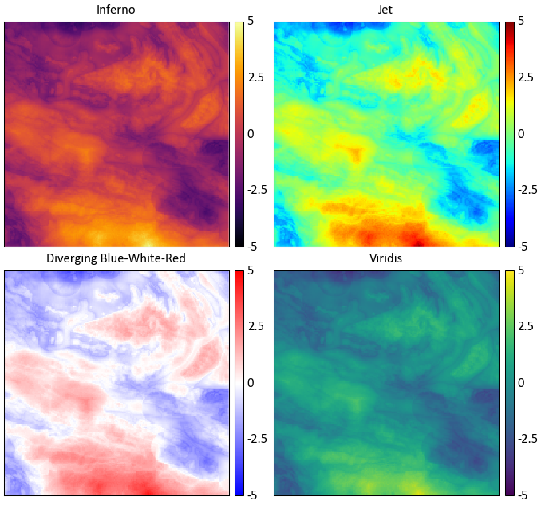
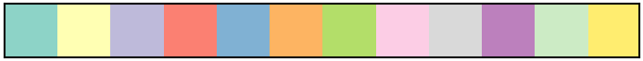

.. _plotting:

Plotting Functions
##################

Plotting functions that are commonly required for geostatistical workflows have been wrapped within pygeostat.
While most are coded with the intention of being plug and play, they can be used as a starting point
and altered to the user's needs.

Please report any bugs, annoyances, or possible enhancements.

Introduction to Plotting with pygeostat
***************************************

The following section introduces some thoughts on plotting figures and utility functions.

Figure Sizes
============

The CCG paper template margin allows for 6 inches of working width space, if two plots are to be put
side by side, they would have to be no more than 3 inches. This is why many of the plotting functions
have a default width of 3 inches.

The UofA's minimum requirement for a thesis states that the left and right margins can not be less
than 1 inch each. As the CCG paper template is the limiting factor, a maximum figure size of 3 inches
is still a good guideline.

Fonts
=====

The CCG paper template uses Calibri, figure text should be the same. The minimum font size for CCG
papers is 8 pt.

The UofA's minimum requirement for a thesis allows the user to select their own fonts keeping
readability in mind.

If you are exporting postscript figures, some odd behavior may occur. Matplotlib needs to be
instructed which type of fonts to export with them, this is handled by using :func:`gs.set_plot_style() <pygeostat.plotting.set_plot_style>` which is within many of the plotting functions. The font
may also be called within the postscript file as a byte string, the function :func:`gs.export_image() <pygeostat.plotting.export_image>` converts this into a working string.

You may find that when saving to a PDF document, the font you select is appearing bold. This happens
due to matplotlib using the same name for fonts within the same family. For example, if you specify
``mpl.rcParams['font.family'] = 'Times New Roman'`` the bold and regular font may have the same name
causing the bold to be selected by default. A fix can be found `here
<http://stackoverflow.com/a/33962423/5028946>`_.

Selection of Colormaps and Colour Palettes
==========================================

**Continuous Colormaps**

While the selection of colormaps may appear to be based on personal preference, there are many factors
that must be accounted for when selecting a colormap. Will your figures be viewed by colour blind
individuals? Will the figure possibly be printed in black and white? Is the colormap perceived by our
minds as intended?

See http://www.research.ibm.com/people/l/lloydt/color/color.HTM for a more in depth discussion on
colormap theory.

**Example**

Which illustrates the most detail in the data?

Colour theory research has shown that the colormap jet may appear detailed due to the colour
differential; however, our perception of the colours distort the data's representation. The
blue-white-red colormap is diverging, therefore structure in the data is implied.

Diverging colormaps should only be used if the underlying structure is understood and needs special
representation.

The inferno and viridis colormaps are sequential, are perceptually uniform, can be printed as black
and white, and are accessible to colour blind viewers. Unfortunately, the inferno color map is some
what jarring, therefore pygeostat's default colormap is viridis as it is more pleasing. Both are not
available as of version 1.5.1 in matplotlib. For more info check out http://bids.github.io/colormap/
and http://matplotlib.org/style_changes.html

**Digital Elevation Models**

There are two custom colormaps available through pygeostat for visualizing digital elevation models.
``topo1`` and ``topo2`` are available through the
:func:`gs.get_cmap() <pygeostat.plotting.utils.get_cmap>` function. They won't look as pixelated as
the examples below.

``topo1``

.. image:: ./figures/cmap_topo1.png

``topo2``

.. image:: ./figures/cmap_topo2.png

**Categorical Colour Palettes**

There are three colour palettes available through pygeostat for visualizing categorical data.
``cat_pastel`` and ``cat_vibrant`` consist of 12 colours, and the third, ``cat_dark``, has 6
available colours. They are available through the :func:`gs.get_palette() <pygeostat.plotting.utils.get_palette>` function. Issues arise when trying to represent a large
number of categorical variables at once as colours will being to converge, meaning categories may
appear to be the same colour.

``cat_pastel``

``cat_vibrant``

.. image:: ./figures/catpalette2.png

``cat_dark``

.. image:: ./figures/catpalette3.png

Changing Figure Aesthetics
==========================

Matplotlib is highly customizable in that font sizes, line widths, and other styling options can all
be changed to the users desires. However, this process can be confusing due to the number of options.
Matplotlib sources these settings from a dictionary called ``mpl.rcParams``. These can either be
changed within a python session or permanently within the matplotlibrc file. For more discussion on
``mpl.rcParams`` and what each setting is, visit http://matplotlib.org/users/customizing.html

As a means of creating a standard, a base pre-set style is set within pygeostat ``ccgpaper`` and some variables of it. They are accessible through the function :func:`gs.set_style() <pygeostat.plotting.set_style.set_style>`. If you'd like to review their settings, the source can be easily viewed from this documentation. If users with to use their own defined ``mpl.rcParams``, the influence of :func:`gs.set_style() <pygeostat.plotting.set_style.set_style>` can be easily turned off so the custom settings are honored, or custom settings can be set through :func:`gs.set_style() <pygeostat.plotting.set_style.set_style>`. Make sure to check out the functionality of
:class:`gs.PlotStyle() <pygeostat.pygeostat_parameters.PlotStyle>`.

Dealing with Memory Leaks from Plotting
=======================================
As HDF5 functionality is enhanced within pygoestat (see :class:`gs.DataFile() <pygeostat.data.data.DataFile>`), loading large datasets into memory will become a viable option. Some plotting functions are being updated to be able to handle these file types, such as :func:`gs.histogram_plot_simulation() <pygeostat.plotting.histogram_plot_simulation>`. If numerous plots are being generated in a loop, you may also notice that your systems physical memory is increasing without being dumped. This is a particular problem if large datasets are being loaded into memory.

Not sure as to the reason, but even if you reuse a name space, the old data attached to it is not removed until your systems memory is maxed out. Matplotlib also stores figures in a loop. The module `gc <https://docs.python.org/2/library/gc.html>`_ has a function ``gc.collect()`` that will dump data not connected to a namespace in python.

The function :func:`gs.clrmplmem() <pygeostat.plotting.utils.clrmplmem>` dumps figure objects currently loaded and clears unused data from memory.

Accuracy Plot
***************
.. autofunction:: pygeostat.plotting.accuracy_plot

Location Plot
***************
.. autofunction:: pygeostat.plotting.location_plot

Histogram Plot
***************
.. autofunction:: pygeostat.plotting.histogram_plot

Histogram Plot (Simulation Check)
***************************************
.. autofunction:: pygeostat.plotting.histogram_plot_simulation

Slice Plot
*************
.. autofunction:: pygeostat.plotting.slice_plot

Slice Plot (Grids)
*****************************
.. autofunction:: pygeostat.plotting.grid_slice_plot

Scatter Plot
*************
.. autofunction:: pygeostat.plotting.scatter_plot

Scatter Plot (Multivariate)
*******************************
The function :func:`gs.scatter_plots() <pygeostat.plotting.utils.scatter_plots>` can be used to study multivariate relationships by plotting the bivariate relationships between different variables.

.. autofunction:: pygeostat.plotting.scatter_plots

Scatter Plot (Multivariate-Comparison)
*******************************************
The function :func:`gs.scatter_plots_lu() <pygeostat.plotting.utils.scatter_plots_lu>` provides the option to have a multivariate comparison between two data sets (e.g. test and training).

.. autofunction:: pygeostat.plotting.scatter_plots_lu

Correlation Matrix Plot 
***************************
.. autofunction:: pygeostat.plotting.correlation_matrix_plot

Drill Plot 
***************************
.. autofunction:: pygeostat.plotting.drill_plot

Pit Plot 
***************************
.. autofunction:: pygeostat.plotting.pit_plot

Quantile-Quantile Plot 
***************************
.. autofunction:: pygeostat.plotting.qq_plot

Probability Plot
***********************
.. autofunction:: pygeostat.plotting.probability_plot

Validation Plot 
***************************
.. autofunction:: pygeostat.plotting.validation_plot

Variogram Plot
***********************
.. autofunction:: pygeostat.plotting.variogram_plot

Loading Plot
***********************
.. autofunction:: pygeostat.plotting.loadings_plot

Contour Plot
***********************
.. autofunction:: pygeostat.plotting.contour_plot

Exporting Images
***********************
.. autofunction:: pygeostat.plotting.export_image

Set Plot Style
***********************
.. autofunction:: pygeostat.plotting.set_plot_style
